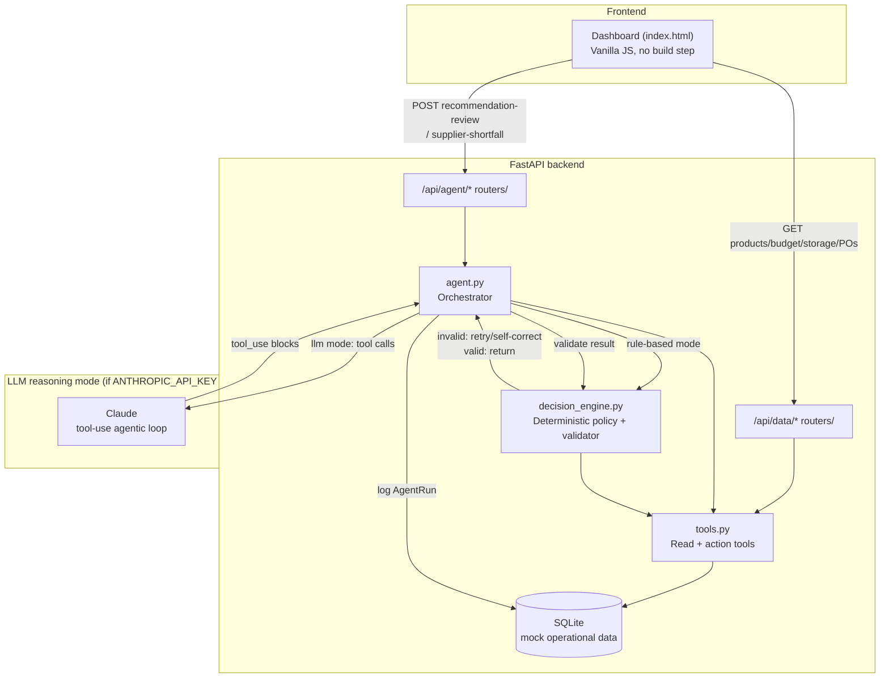
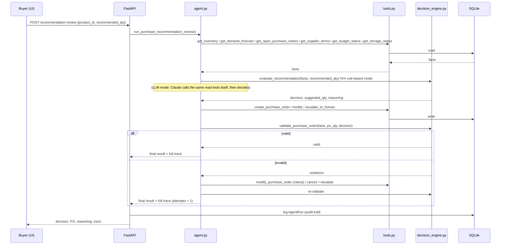
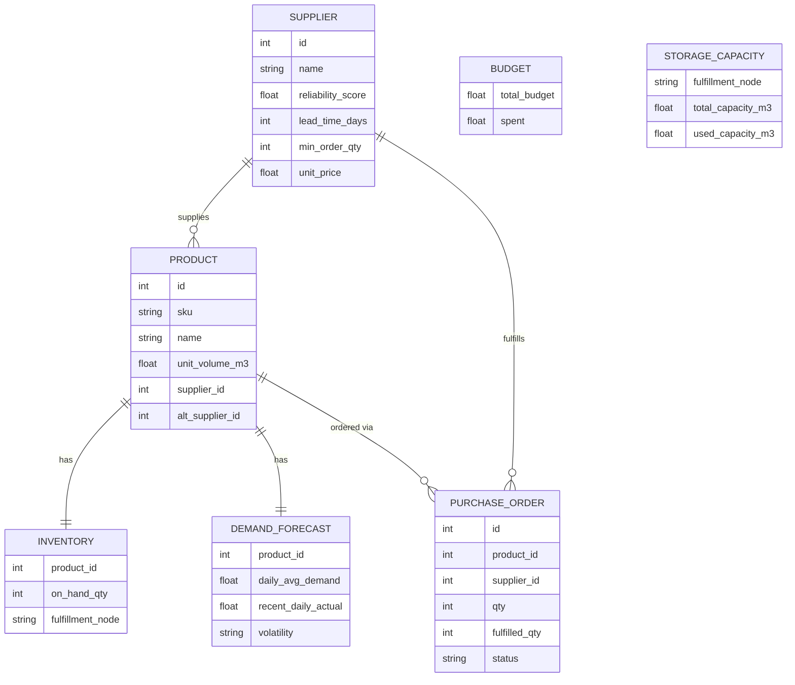

# Architecture

```mermaid
flowchart TD
    subgraph Frontend
        UI["Dashboard (index.html)\nVanilla JS, no build step"]
    end

    subgraph Backend["FastAPI backend"]
        AR["/api/agent/* routers/"]
        DR["/api/data/* routers/"]
        AG["agent.py\nOrchestrator"]
        DE["decision_engine.py\nDeterministic policy + validator"]
        TL["tools.py\nRead + action tools"]
        DB[(SQLite\nmock operational data)]
    end

    subgraph LLMPath["LLM reasoning mode (if ANTHROPIC_API_KEY set)"]
        CL["Claude\ntool-use agentic loop"]
    end

    UI -- "POST recommendation-review\n/ supplier-shortfall" --> AR
    UI -- "GET products/budget/storage/POs" --> DR
    AR --> AG
    DR --> TL
    AG -- "rule-based mode" --> DE
    AG -- "llm mode: tool calls" --> CL
    CL -- "tool_use blocks" --> AG
    AG --> TL
    DE --> TL
    TL --> DB
    AG -- "validate result" --> DE
    DE -- "invalid: retry/self-correct\nvalid: return" --> AG
    AG -- "log AgentRun" --> DB
```

## Request flow: Scenario 1 (Purchase Recommendation Review)

```mermaid
sequenceDiagram
    participant U as Buyer (UI)
    participant API as FastAPI
    participant Agent as agent.py
    participant Tools as tools.py
    participant DE as decision_engine.py
    participant DB as SQLite

    U->>API: POST recommendation-review {product_id, recommended_qty}
    API->>Agent: run_purchase_recommendation_review()
    Agent->>Tools: get_inventory / get_demand_forecast / get_open_purchase_orders / get_supplier_terms / get_budget_status / get_storage_status
    Tools->>DB: read
    DB-->>Tools: facts
    Tools-->>Agent: facts
    Agent->>DE: evaluate_recommendation(facts, recommended_qty)   %% rule-based mode
    Note over Agent: (LLM mode: Claude calls the same read tools itself, then decides)
    DE-->>Agent: decision, suggested_qty, reasoning
    Agent->>Tools: create_purchase_order / modify / escalate_to_human
    Tools->>DB: write
    Agent->>DE: validate_purchase_order(facts, po_qty, decision)
    alt valid
        DE-->>Agent: valid
        Agent-->>API: final result + full trace
    else invalid
        DE-->>Agent: violations
        Agent->>Tools: modify_purchase_order (clamp) / cancel + escalate
        Agent->>DE: re-validate
        Agent-->>API: final result + full trace (attempts > 1)
    end
    API->>DB: log AgentRun (audit trail)
    API-->>U: decision, PO, reasoning, trace
```

## Data model

```mermaid
erDiagram
    SUPPLIER ||--o{ PRODUCT : supplies
    PRODUCT ||--|| INVENTORY : has
    PRODUCT ||--|| DEMAND_FORECAST : has
    PRODUCT ||--o{ PURCHASE_ORDER : "ordered via"
    SUPPLIER ||--o{ PURCHASE_ORDER : fulfills

    SUPPLIER {
        int id
        string name
        float reliability_score
        int lead_time_days
        int min_order_qty
        float unit_price
    }
    PRODUCT {
        int id
        string sku
        string name
        float unit_volume_m3
        int supplier_id
        int alt_supplier_id
    }
    INVENTORY {
        int product_id
        int on_hand_qty
        string fulfillment_node
    }
    DEMAND_FORECAST {
        int product_id
        float daily_avg_demand
        float recent_daily_actual
        string volatility
    }
    PURCHASE_ORDER {
        int id
        int product_id
        int supplier_id
        int qty
        int fulfilled_qty
        string status
    }
    BUDGET {
        float total_budget
        float spent
    }
    STORAGE_CAPACITY {
        string fulfillment_node
        float total_capacity_m3
        float used_capacity_m3
    }
```
